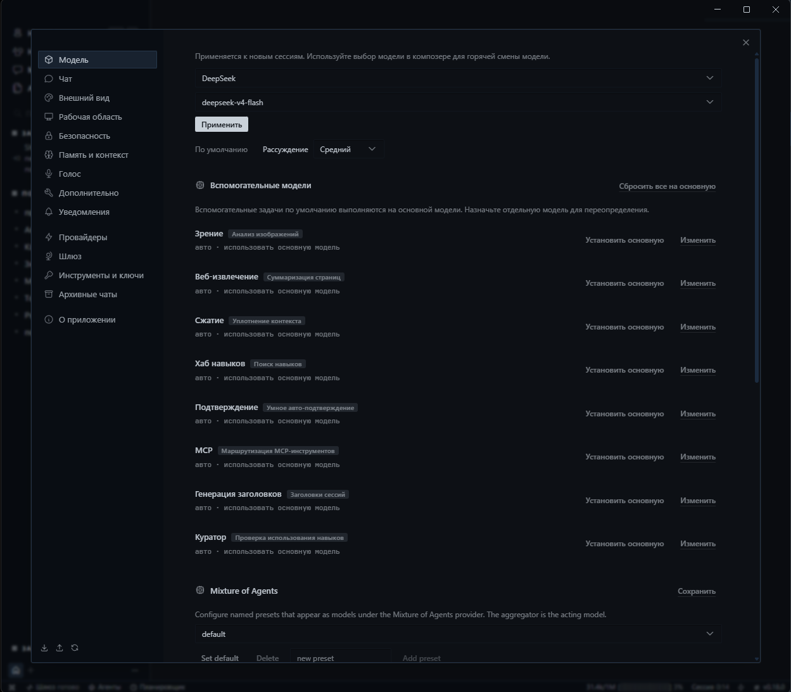
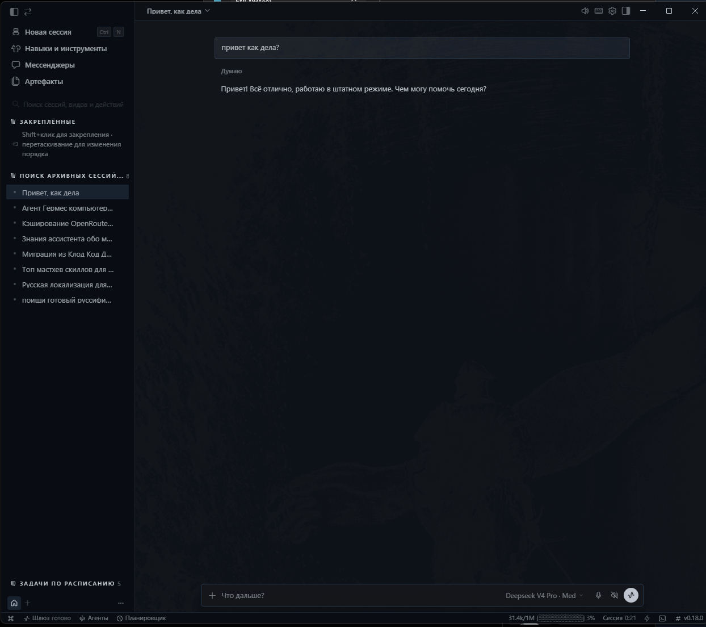
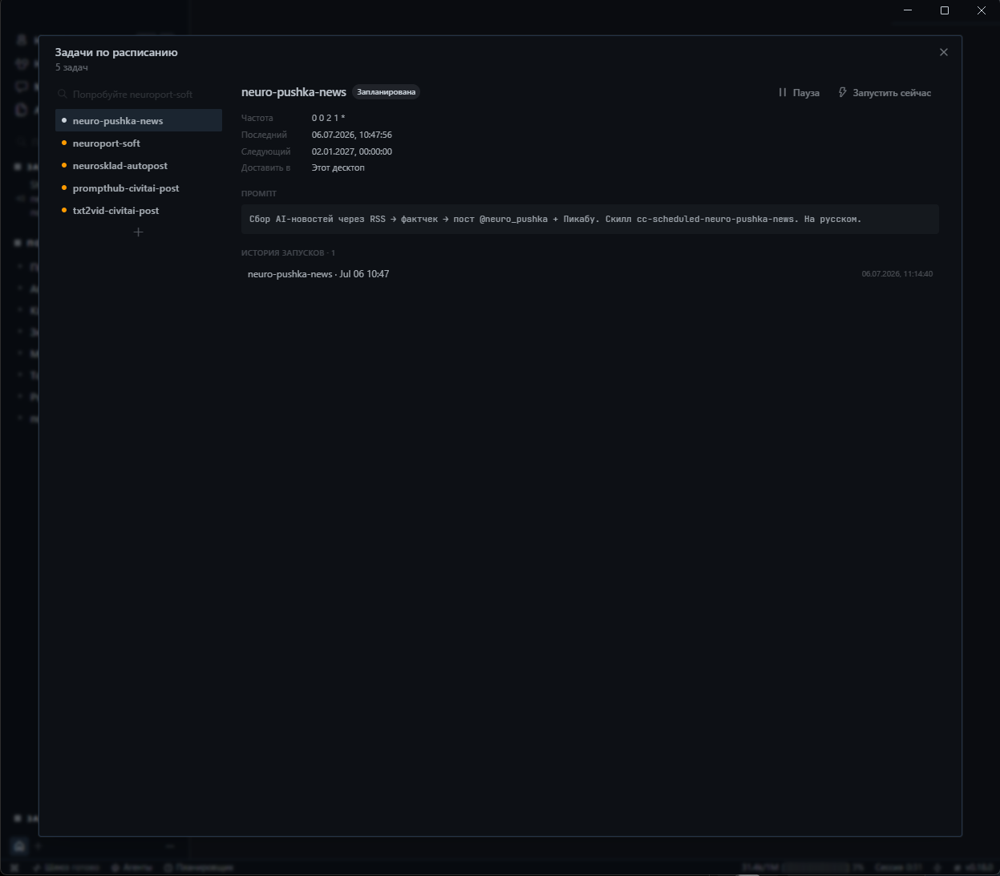
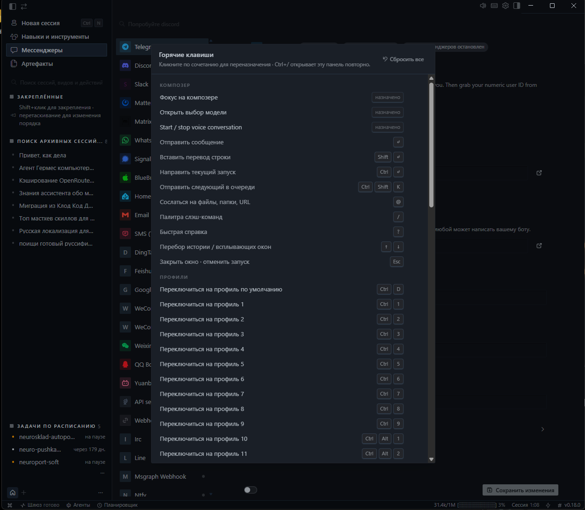

<div align="center">

# Hermes Agent — Русская локализация

**Полный перевод интерфейса Hermes Agent Desktop на русский язык — 2218 строк, defineLocale, автоустановка.**

[](LICENSE)
[](https://github.com/timoncool/hermes-ru-locale/stargazers)
[](https://github.com/timoncool/hermes-ru-locale/commits)
[](https://github.com/nousresearch/hermes-agent)



</div>

## Описание

Полная русская локализация десктопного приложения [Hermes Agent](https://github.com/nousresearch/hermes-agent) от Nous Research — все 2218 ключей интерфейса переведены на русский язык. Перевод сделан через `defineLocale()` — механизм частичных переводов Hermes, поэтому **не ломается при обновлениях** (новые строки просто остаются на английском).

Установка за одну команду через PowerShell: авто-определение пути Hermes, копирование файлов, патч конфигов TypeScript и сборка.

## Возможности

- **2218 переведённых ключей** — весь интерфейс Hermes Agent Desktop на русском
- **defineLocale** — частичный перевод, не ломается при обновлении Hermes
- **Автоустановка** — `install.ps1` сам найдёт Hermes, скопирует файлы, пропатчит конфиги
- **Перевод констант** — названия и описания полей настроек тоже на русском
- **Алиасы раскладок** — `ru`, `ru-ru`, `ru_ru`, `русский` — любой вариант работает
- **Один файл перевода** — `ru.ts` содержит всё, легко править и дополнять
- **Windows** — скрипт установки под PowerShell (Windows 10/11)

## Быстрый старт

1. **Клонировать**
   ```bash
   git clone https://github.com/timoncool/hermes-ru-locale.git
   cd hermes-ru-locale
   ```

2. **Установить**
   ```powershell
   powershell -ExecutionPolicy Bypass -File install.ps1
   ```

3. **Выбрать язык**
   ```
   Hermes Desktop → Settings → Appearance → Русский
   ```

## Ручная установка

Если автоустановщик не сработал:

```powershell
# Копируем файлы перевода
copy ru.ts %LOCALAPPDATA%\hermes\hermes-agent\apps\desktop\src\i18n\ru.ts
copy ru-constants.ts %LOCALAPPDATA%\hermes\hermes-agent\apps\desktop\src\app\settings\ru-constants.ts

# Добавляем 'ru' в types.ts (если ещё нет)
# export type Locale = 'en' | 'zh' | 'zh-hant' | 'ja' | 'ru'

# Регистрируем в catalog.ts:
# import { ru } from './ru'
# ...ru в массиве locales...

# Добавляем в languages.ts:
# { id: 'ru', name: 'Русский', englishName: 'Russian', configValue: 'ru' }

# Собираем
cd %LOCALAPPDATA%\hermes\hermes-agent\apps\desktop
npm run build
```

## Что в пакете

| Файл | Назначение | Объём |
|------|-----------|-------|
| `ru.ts` | Основной перевод интерфейса (defineLocale) | 2218 строк |
| `ru-constants.ts` | Перевод названий и описаний настроек | 60 строк |
| `install.ps1` | Автоустановщик для Windows | 90 строк |

## Как это работает

`ru.ts` использует `defineLocale()` — механизм Hermes для частичных переводов. Любые ключи, отсутствующие в русском переводе, автоматически подставляются из английского. Это значит, что перевод **не ломается при обновлении Hermes** — новые строки просто будут на английском, пока их не переведут.

`install.ps1` автоматически:
1. Находит установку Hermes (через `hermes` в PATH или `%LOCALAPPDATA%\hermes`)
2. Копирует `ru.ts` и `ru-constants.ts`
3. Пропатчивает `types.ts`, `catalog.ts`, `languages.ts`
4. Запускает `npm run build`

## Требования

- **Hermes Agent** v0.18.0 или новее (установлен из исходников)
- **Node.js** и **npm** (для сборки десктопа)
- **Windows 10/11** (скрипт установки — PowerShell)

## Скриншоты

<details>
<summary>Hermes Agent на русском — скриншоты интерфейса</summary>

### Главное окно


### Чат


### Настройки


### Выбор языка


</details>

## Обновление перевода

При обновлении Hermes Agent — просто запустите `install.ps1` заново. Новые непереведённые строки будут на английском, остальное останется на русском.

Хотите помочь с переводом новых строк? Pull requests приветствуются — править нужно только `ru.ts`.

## Другие проекты

| Проект | Описание |
|--------|----------|
| [ACE-Step Studio](https://github.com/timoncool/ACE-Step-Studio) | AI-студия музыки — песни, вокал, каверы, клипы |
| [telegram-api-mcp](https://github.com/timoncool/telegram-api-mcp) | Telegram Bot API как MCP-сервер |
| [civitai-mcp-ultimate](https://github.com/timoncool/civitai-mcp-ultimate) | Civitai API как MCP-сервер |
| [VideoSOS](https://github.com/timoncool/videosos) | AI-видеопродакшн в браузере |
| [GitLife](https://github.com/timoncool/gitlife) | Жизнь в неделях — интерактивный календарь |
| [ScreenSavy.com](https://github.com/timoncool/ScreenSavy.com) | Генератор эмбиент-экранов |

## Авторы

- **Nerual Dreming** — [Telegram](https://t.me/nerual_dreming) | [neuro-cartel.com](https://neuro-cartel.com) | [ArtGeneration.me](https://artgeneration.me)
- Основано на переводе [warment/hermes-desktop-ru](https://github.com/warment/hermes-desktop-ru)

## Поддержать автора

Я создаю опенсорс софт и занимаюсь исследованиями в области ИИ. Большая часть всего, что я делаю, находится в открытом доступе. Ваши пожертвования позволяют мне создавать и исследовать больше, не отвлекаясь на поиск еды для продолжения существования =)

**[Все способы поддержки](https://github.com/timoncool/ACE-Step-Studio/blob/master/DONATE.md)** | **[dalink.to/nerual_dreming](https://dalink.to/nerual_dreming)** | **[boosty.to/neuro_art](https://boosty.to/neuro_art)**

- **BTC:** `1E7dHL22RpyhJGVpcvKdbyZgksSYkYeEBC`
- **ETH (ERC20):** `0xb5db65adf478983186d4897ba92fe2c25c594a0c`
- **USDT (TRC20):** `TQST9Lp2TjK6FiVkn4fwfGUee7NmkxEE7C`

## Star History

<a href="https://www.star-history.com/?repos=timoncool%2Fhermes-ru-locale&type=date&legend=top-left">
 <picture>
   <source media="(prefers-color-scheme: dark)" srcset="https://api.star-history.com/svg?repos=timoncool/hermes-ru-locale&type=date&theme=dark&legend=top-left" />
   <source media="(prefers-color-scheme: light)" srcset="https://api.star-history.com/svg?repos=timoncool/hermes-ru-locale&type=date&legend=top-left" />
   
 </picture>
</a>

## Лицензия

MIT — делайте что хотите, ссылка на автора приветствуется.
